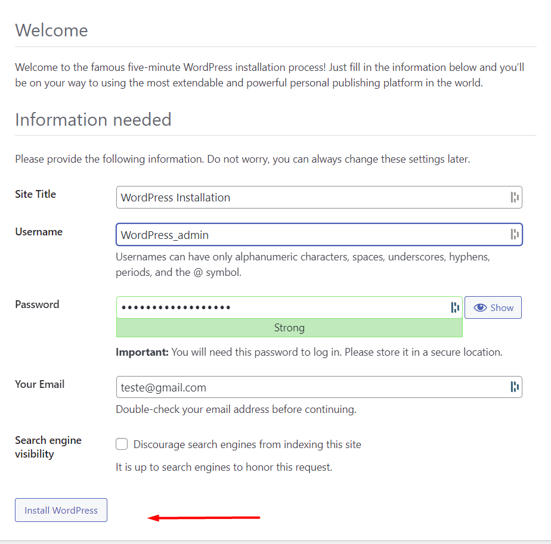

# WordPress Configuration

## WordPress Configuration

1. After acess the <mark style="color:red;">`http://your_ip_address:8080`</mark> fill in the information you need to fill and login.

<figure><figcaption>
Fig 1. WordPress Configuration
</figcaption></figure>
